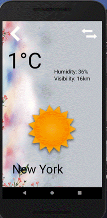

**ClimaApp** is a weather checker application for Android.

## User Stories

The following **required** functionality is complete:

* main layout display the temperature, visbility and humidity of current city
* User can change city, theme and theme through the setting page
* On history user can check the history temperature in the pass 30 days

## Video Walkthrough 

Here's a walkthrough of implemented user stories:

GIF created with [LiceCap](http://www.cockos.com/licecap/).

## Notes

Describe any challenges encountered while building the app.
* I never learn swift before, so I have to start learning swift from beginning in a short time.
* When I try to develop the UI of the app, I need to use photoshop, which looks like is not a computer science field.

## License

    Copyright [Jie Lan / Jinyan Lin] [name of copyright owner]

    Licensed under the Apache License, Version 2.0 (the "License");
    you may not use this file except in compliance with the License.
    You may obtain a copy of the License at

        http://www.apache.org/licenses/LICENSE-2.0

    Unless required by applicable law or agreed to in writing, software
    distributed under the License is distributed on an "AS IS" BASIS,
    WITHOUT WARRANTIES OR CONDITIONS OF ANY KIND, either express or implied.
    See the License for the specific language governing permissions and
    limitations under the License.
